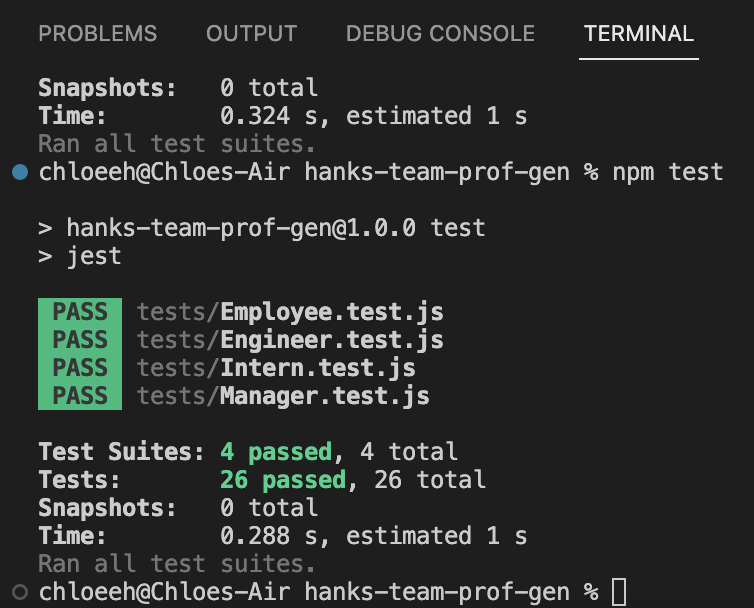

# wk10 - Team Profile Generator

## Description
The purpose of this project is to use inquirer, jest, and NodeJS to generate an html file which displays a user's team based on the user's answers to the prompts from the terminal. 
This team starts off with requiring input for a manager, then prompts the user to include either and engineer, intern, or build the team based on the previously input information. The user will be prompted to select between the latter 3 choices until the user selects to finish and build the team.

The following comments are included at the top of each of the test.js files. It guides the developer on how to use the jest package to run tests:

// Follow this link for an example: https://jestjs.io/docs/getting-started

// Make sure to modify the "scripts:" section to "jest" instead

// of the placeholder text

// To run tests, npm install --save-dev jest

// then, npm test

// it will run all .test.js files

The walkthrough video below shows that all tests passed when "npm test" is run. Then it shows the viewer how to invoke the prompts and how to, generally, answer them. Once the user selects to finish and build the team, a file called "teamProfile.html" is generated in ./dist file

The 1st image below shows the command terminal when the command "npm test" is run. All tests passed.

The 2nd image shows the terminal as "node index.js" prompts the user for input.

The third image shows the html output of 1 manager, 1 engineer and 1 intern.

## Installation

N/A

## Usage

Watch the video video by opening the [Google Drive Link](https://drive.google.com/file/d/1Pysm9BNmkAtE50wRnG-ctDrD8Z2msal2/view?usp=share_link)

## Credits

Resources used:
1) Bootcamp Pre-work Modules
2) Bootcamp 10-OOP
3) [Writing tests and working with jet](https://jestjs.io/docs/getting-started)

## License

Please refer to the LICENSE in the repository.